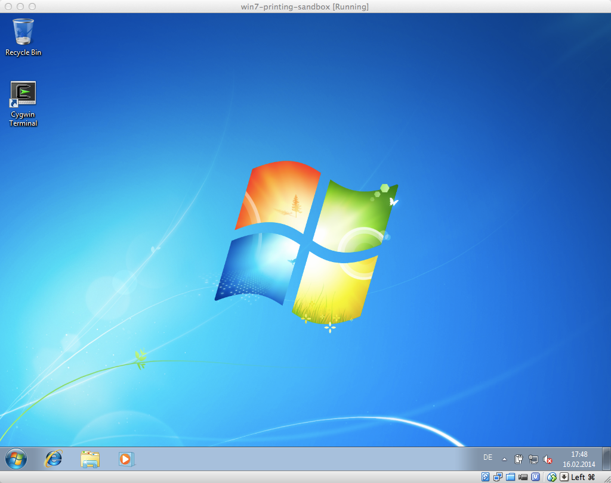

# win7-printing-sandbox

An instant Windows 7 VM for use as a printing sandbox.


# Installation

You'll need [Vagrant](http://vagrantup.com) and [VirtualBox](http://virtualbox.org) to create and run the Windows 7 sandbox. For building the basebox you'll need [Packer](http://packer.io) too.  For more baseboxes you could visit my [basebox-packer](https://github.com/DieterReuter/basebox-packer) repo.


### Step 1: building the basebox with Packer

So, let's start and clone into my repo and build with `./build-basebox.sh`(for Mac and Linux) or `build-basebox.bat`(for Windows).

```bash
git clone https://github.com/DieterReuter/win7-printing-sandbox.git
cd win7-printing-sandbox
./build-basebox.sh
```

Tipp:
Packer uses a local cache directory `./packer_cache` to store the downloaded .ISO files. If you like to use a global packer_cache directory instead, just define an environment variable `PACKER_CACHE_DIR` before running the `./build-basebox.sh`script.
```bash
PACKER_CACHE_DIR=/tmp/packer_cache ./build-basebox.sh
```

### Step 2: register the basebox to Vagrant

You should have the Windows 7 basebox ready and registered as `win7-box` to your Vagrant environment.
```bash
vagrant box add win7-box virtualbox/windows7x64sp1.box
```

You can verify what baseboxes are registered in your Vagrant environment with the following command.
```bash
vagrant box list
```

### Step 3: sorry, there's no 3


# How do use the Windows 7 Sandbox

To get started, you only have to use `vagrant up`, and you're in the game.
```bash
cd win7-printing-sandbox
vagrant up
```

Now you can use the fresh Windows 7 sandbox. Log in with the standard Vagrant user account, `username=vagrant` with `password=vagrant`.

Here is our finished Windows 7 sandbox running on a Mac OSX host:
 


# Licensing
Copyright (c) 2014 Dieter Reuter

MIT License, see LICENSE.txt for more details.


    Last successful builds:
    * 16.02.2014: build on a Mac OSX 10.9.1 host with Packer 0.5.1, Vagrant 1.4.3, VirtualBox 4.3.6
    * 16.02.2014: build on a Windows 7 host with Packer 0.5.1, Vagrant 1.4.2, VirtualBox 4.3.6
